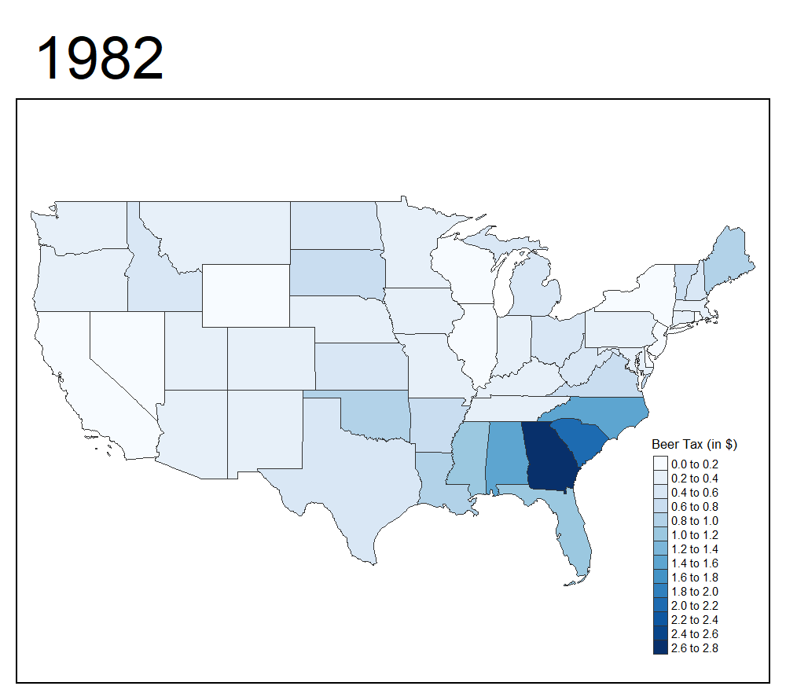
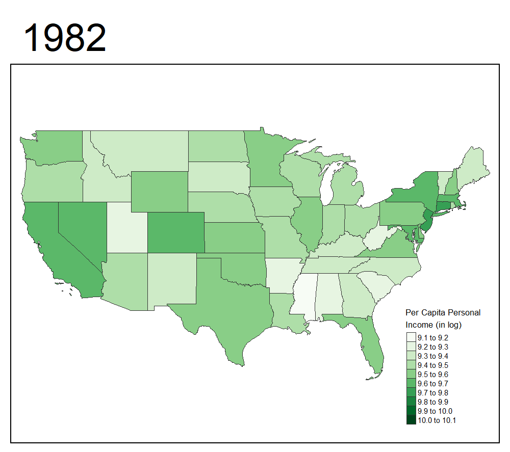

```{r setup, include = FALSE}
knitr::opts_chunk$set(echo = FALSE, warning = FALSE, message = FALSE, 
                      fig.width = 6, fig.height = 4, fig.align = 'center')
```

<style>body {text-align: justify}</style>

[Github Repo](https://github.com/krish1919ls/drunk_driving_fatalities){target='_blank'}

## Introduction
According to National Highway Traffic Safety Administration, almost 30 people in the United States die in drunk-driving crashes daily — that is one person every 50 minutes. These deaths have fallen by a third in the last three decades (from 1980s); however, drunk-driving crashes claim more than 10,000 lives per year. This project investigates the importance of beer tax and other state laws on motor vehicle fatality rate. Effects of economic and demographic factors are also considered in the regression models to understand the true effects.

## Background & Literature Review
Ruhm, C. (1996) explored the impact of beer taxes and a variety of alcohol-control policies on motor vehicle fatality rates. Special attention was paid to omitted variables biases resulting from failing to adequately control for grassroots efforts to reduce drunk driving, the enactment of other state laws which simultaneously operate to reduce highway fatalities, and the economic conditions existing at the time the legislation is passed. In the preferred models, most of the regulations had little or no impact on traffic mortality. By contrast, higher beer taxes were associated with reductions in crash deaths and the result was relatively robust across specifications.<br/>
Stock, J.H. and Watson, M.W. (2007) explains the importance of fixed effect models (both state and time effects) in determining the economic estimates and summarises Ruhm, C (1996) research.<br/>
However, demographic factors are not included in the econometric models proposed before. Consequently, such variables are included in the regression models.

```{r load libraries and set options}
library(foreign)
library(tidyverse)
library(plm)
library(plotly)
library(RColorBrewer)
library(stargazer)
```

## Data

```{r load data}
cf.df <- read.dta('../data/car_fatalities.dta', convert.dates = TRUE, convert.factors = TRUE, 
                  missing.type = FALSE, convert.underscore = FALSE, warn.missing.labels = TRUE)

cf.df$year <-  as.factor(cf.df$year)

cf.df$mldabin <- cut(cf.df$mlda, breaks = 18:22, include.lowest = TRUE, right = FALSE)
cf.df[is.na(cf.df$jaild),]$jaild <- 0
cf.df$jaild <- as.factor(cf.df$jaild)
cf.df[is.na(cf.df$comserd),]$comserd <- 0
cf.df$comserd <- as.factor(cf.df$comserd)
cf.df$jailcomserd <- ifelse(cf.df$jaild == 1 | cf.df$comserd == 1, 1, 0)
cf.df$lnperinc <- log(cf.df$perinc)

cf.df$mrall <- cf.df$mrall * 100000
cf.df$mralln <- cf.df$mralln * 100000
cf.df$mraidall <- cf.df$mraidall * 100000
cf.df$mra1517 <- cf.df$mra1517 * 100000
cf.df$mra1517n <- cf.df$mra1517n * 100000
cf.df$mra1820 <- cf.df$mra1820 * 100000
cf.df$mra1820n <- cf.df$mra1820n * 100000
cf.df$mra2124 <- cf.df$mra2124 * 100000
cf.df$mra2124n <- cf.df$mra2124n * 100000
cf.df$mraua <- ifelse(cf.df$mldabin == '[18,19)', cf.df$a1517/cf.df$pop1517, 
                      (cf.df$a1517 + cf.df$a1820)/(cf.df$pop1517 + cf.df$pop1820)) 
cf.df$mraua <- cf.df$mraua * 100000

cf.df <- pdata.frame(cf.df, index = c('state', 'year'))

state.list <- unique(cf.df$state)
```

### Dependent Variables
The dataset contains vehicle fatality rate for 48 states (except Alaska and Hawaii) annually for 1982 through 1988. The fatality rates have highly significant state effects. Although the time effects are significant but since we have data for only seven years, the yearly fatality trends for various states are very slightly decreasing. New Mexico has historically high fatality rates with median 36.89 fatalities per 100,000 residents and on the other hand, Rhode Island has the least fatality rates with median 11.26 fatalities per 100,000 residents.

```{r dependent: vehicle fatality rate}
subplot(
cf.df %>%
  plot_ly(x = ~year, y = ~mrall, color = ~state, 
          colors = colorRampPalette(brewer.pal(n = 8, name = 'Dark2'))(length(state.list)),
          type = 'scatter', mode = 'markers+lines') %>%
  layout(xaxis = list(title = 'Year'),
         showlegend = FALSE),
cf.df %>%
  plot_ly(y = ~mrall, type = 'box', color = ~year, colors = 'Dark2') %>%
  layout(showlegend = FALSE),
shareY = TRUE) %>%
subplot(
cf.df %>%
  plot_ly(y = ~mrall, type = 'box', color = ~state, 
          colors = colorRampPalette(brewer.pal(n = 8, name = 'Dark2'))(length(state.list))) %>%
  layout(showlegend = FALSE),
nrows = 2) %>%
layout(title = 'Vehicle Fatality Rate (per 100,000)')
```

The dataset also contains fatality parameters for three different age groups – 15-17 year old, 17-20 year old and 21-24 year old. Night-time fatality rates and single vehicle fatality rates are also included (Appendix A).

### Independent Variables
Various parameters can be divided into three different categories – state laws, economic conditions and demographic factors.

#### State Laws
State laws include Beer Tax, Minimum Legal Drinking Age, Mandatory Jail Sentence and Mandatory Community Service. Tax on a case of beer is highest for Georgia and lowest for Wyoming. Similar to fatality rate, state effects are very striking for beer tax as well. Surprisingly, the state beer taxes are decreasing for added year for many states. According to an article in New York Times, the Secretary of Transportation was required to withhold 5% of Federal highway construction funds from those states that did not enact a minimum drinking age of 21 by October 1, 1986. The Secretary was required to withhold 10% of the funds for states that did not act by October 1, 1987. Therefore, all the states except Wyoming have set the minimum legal drinking age to 21 complying to federal recommendations by 1988. Regarding legal actions, only Colorado and Florida have just the mandatory community service. By 1988, only one third of US states have mandatory community service and/or mandatory jail sentence.

##### {.tabset .tabset-fade}
###### Beer Tax

```{r independent: beer tax}
subplot(
cf.df %>%
  plot_ly(x = ~year, y = ~beertax, color = ~state, 
          colors = colorRampPalette(brewer.pal(n = 8, name = 'Dark2'))(length(state.list)),
          type = 'scatter', mode = 'markers+lines') %>%
  layout(xaxis = list(title = 'Year'),
         showlegend = FALSE),
cf.df %>%
  plot_ly(y = ~beertax, type = 'box', color = ~year, colors = 'Dark2') %>%
  layout(showlegend = FALSE),
shareY = TRUE) %>%
subplot(
cf.df %>%
  plot_ly(y = ~beertax, type = 'box', color = ~state, 
          colors = colorRampPalette(brewer.pal(n = 8, name = 'Dark2'))(length(state.list))) %>%
  layout(showlegend = FALSE),
nrows = 2) %>%
layout(title = 'Beer Tax (in $)')
```

###### Minimum Legal Drinking Age

```{r independent: min legal drinking age}
cf.df %>%
  group_by(year, mldabin) %>%
  summarise(tot = n()) %>%
  plot_ly(x = ~year, y = ~tot, color = ~mldabin, colors = 'Greens', type = 'bar') %>%
  layout(title = 'Minimum Legal Drinking Age', 
         xaxis = list(title = 'Year'), yaxis = list(title = '# of States'), barmode = 'stack')
```

###### Community Service and Jail Sentence

```{r independent: community service + jail sentence}
knitr::kable(cf.df %>%
  filter(comserd == 1 & jaild == 0) %>%
  group_by(year) %>%
  summarise(cstate = paste(state, collapse = ', ')),
  col.names = c('Year', 'States Implementing Only Mandatory Community Service'))

knitr::kable(cf.df %>%
  filter(comserd == 1 | jaild == 1) %>%
  group_by(year) %>%
  summarise(cjstate = paste(state, collapse = ', ')),
  col.names = c('Year', 'States Implementing either Community Service or Jail Sentence'))
```

##### {-}
<br/>

#### Existing Economic Conditions
Three major underlying economic conditions are included in the regression models. These are Unemployment Rate, Per Capita Personal Income and Change in Gross State Product. According to Ruhm, C. (1996), ignoring economic parameters results in omitted variable biases. These variables vary across states but generally follow national trends annually. Unemployment rates decreased and per capita personal income increased in the given period. The variance of per capita income also increased and therefore, use of logarithm of the per capita income for the models is needed. Change in gross state product is stationary complying to AR (1) trend.

##### {.tabset .tabset-fade}
###### State Unemployment Rate

```{r independent: state unemployment rate}
subplot(
cf.df %>%
  plot_ly(x = ~year, y = ~unrate, color = ~state, 
          colors = colorRampPalette(brewer.pal(n = 8, name = 'Dark2'))(length(state.list)),
          type = 'scatter', mode = 'markers+lines') %>%
  layout(xaxis = list(title = 'Year'),
         showlegend = FALSE),
cf.df %>%
  plot_ly(y = ~unrate, type = 'box', color = ~year, colors = 'Dark2') %>%
  layout(showlegend = FALSE),
shareY = TRUE) %>%
subplot(
cf.df %>%
  plot_ly(y = ~unrate, type = 'box', color = ~state, 
          colors = colorRampPalette(brewer.pal(n = 8, name = 'Dark2'))(length(state.list))) %>%
  layout(showlegend = FALSE),
nrows = 2) %>%
layout(title = 'State Unemployment Rate (in %)')
```

###### Per Capita Personal Income

```{r independent: per capita personal income, fig.height = 2}
subplot(
cf.df %>%
  plot_ly(x = ~year, y = ~perinc, color = ~state, 
          colors = colorRampPalette(brewer.pal(n = 8, name = 'Dark2'))(length(state.list)),
          type = 'scatter', mode = 'markers+lines') %>%
  layout(xaxis = list(title = 'Year'),
         showlegend = FALSE),
cf.df %>%
  plot_ly(y = ~perinc, type = 'box', color = ~year, colors = 'Dark2') %>%
  layout(showlegend = FALSE),
shareY = TRUE) %>%
layout(title = 'Per Capita Personal Income (in $)',
       yaxis = list(title = ''))
```

```{r independent: log per capita personal income}
subplot(
cf.df %>%
  plot_ly(x = ~year, y = ~lnperinc, color = ~state, 
          colors = colorRampPalette(brewer.pal(n = 8, name = 'Dark2'))(length(state.list)),
          type = 'scatter', mode = 'markers+lines') %>%
  layout(xaxis = list(title = 'Year'),
         showlegend = FALSE),
cf.df %>%
  plot_ly(y = ~lnperinc, type = 'box', color = ~year, colors = 'Dark2') %>%
  layout(showlegend = FALSE),
shareY = TRUE) %>%
subplot(
cf.df %>%
  plot_ly(y = ~lnperinc, type = 'box', color = ~state, 
          colors = colorRampPalette(brewer.pal(n = 8, name = 'Dark2'))(length(state.list))) %>%
  layout(showlegend = FALSE),
nrows = 2) %>%
layout(title = 'Per Capita Personal Income (in log)')
```

###### GSP Rate of Change

```{r independent: gsp rate of change}
subplot(
cf.df %>%
  plot_ly(x = ~year, y = ~gspch, color = ~state, 
          colors = colorRampPalette(brewer.pal(n = 8, name = 'Dark2'))(length(state.list)),
          type = 'scatter', mode = 'markers+lines') %>%
  layout(xaxis = list(title = 'Year'),
         showlegend = FALSE),
cf.df %>%
  plot_ly(y = ~gspch, type = 'box', color = ~year, colors = 'Dark2') %>%
  layout(showlegend = FALSE),
shareY = TRUE) %>%
subplot(
cf.df %>%
  plot_ly(y = ~gspch, type = 'box', color = ~state, 
          colors = colorRampPalette(brewer.pal(n = 8, name = 'Dark2'))(length(state.list))) %>%
  layout(showlegend = FALSE),
nrows = 2) %>%
layout(title = 'GSP Rate of Change')
```

##### {-}
<br/>

#### Demographic Factors
Various demographic factors are also included in the dataset such as Per Capita Pure Alcohol Consumption and Average Mile per Driver. There is a gradual decreasing trend in per capita pure alcohol consumption for added year for most of the states. Nevada and New Hampshire consume almost 250% more alcohol than the national average. People in Wyoming, on average, commute the most and New Yorkers commute the least on the other hand. In the year 1984, the average mile per driver recorded for Nebraska was abnormally extremely high. Other variables that come in this grouping are % of Southern Baptists, % of Mormons, % of Residents in Dry Counties and % of Young Drivers (aged 15-24) in the 48 states.

##### {.tabset .tabset-fade}
###### Per Capita Pure Alcohol Consumption

```{r independent: per capita pure alcohol consumption}
subplot(
cf.df %>%
  plot_ly(x = ~year, y = ~spircons, color = ~state, 
          colors = colorRampPalette(brewer.pal(n = 8, name = 'Dark2'))(length(state.list)),
          type = 'scatter', mode = 'markers+lines') %>%
  layout(xaxis = list(title = 'Year'),
         showlegend = FALSE),
cf.df %>%
  plot_ly(y = ~spircons, type = 'box', color = ~year, colors = 'Dark2') %>%
  layout(showlegend = FALSE),
shareY = TRUE) %>%
subplot(
cf.df %>%
  plot_ly(y = ~spircons, type = 'box', color = ~state, 
          colors = colorRampPalette(brewer.pal(n = 8, name = 'Dark2'))(length(state.list))) %>%
  layout(showlegend = FALSE),
nrows = 2) %>%
layout(title = 'Per Capita Pure Alcohol Consumption (in gal)')
```

###### Average Mile per Driver

```{r independent: average mile per driver}
subplot(
cf.df %>%
  plot_ly(x = ~year, y = ~vmiles, color = ~state, 
          colors = colorRampPalette(brewer.pal(n = 8, name = 'Dark2'))(length(state.list)),
          type = 'scatter', mode = 'markers+lines') %>%
  layout(xaxis = list(title = 'Year'),
         showlegend = FALSE),
cf.df %>%
  plot_ly(y = ~vmiles, type = 'box', color = ~year, colors = 'Dark2') %>%
  layout(showlegend = FALSE),
shareY = TRUE) %>%
subplot(
cf.df %>%
  plot_ly(y = ~vmiles, type = 'box', color = ~state, 
          colors = colorRampPalette(brewer.pal(n = 8, name = 'Dark2'))(length(state.list))) %>%
  layout(showlegend = FALSE),
nrows = 2) %>%
layout(title = 'Average Mile per Driver')
```

##### {-}
## Empirical Approach
The dataset resembles that of balanced panel with 48 entities (cross-sectional units) and 7 time periods. Most of the econometric estimates in this report comes from entities and time fixed effect model of the form: Y~it~ = β~i~X~it~ + α~i~ + λ~t~ + u~it~ where Yit is the fatality rate for state i and year t. X~it~ are the state laws, prevailing economic conditions, and demographic factors for state i and year t. α~i~ are the enitity/individual effects and λ~t~ are the time effects. These economic estimates are compared with those of random effect model using Nerlove estimator (1971) where entity and time effects are not fixed, i.e., relaxing (α~i~ - $\hat{α}$~i~) = 0 and (λ~i~ - $\hat{λ}$~i~) = 0.<br/>
Following graphs illustrate the importance of entity and time effects.<br/>

##### {.tabset .tabset-fade}
###### OLS Model

```{r importance of panel 1}
cf.df %>%
  plot_ly(x = ~beertax,y = ~mrall, type = 'scatter', mode = 'markers', name = 'Point') %>%
  add_lines(x = ~beertax, y = fitted(lm(mrall ~ beertax, data = cf.df)), name = 'Fitted Line') %>%
  layout(title = 'Regression without Entity and Time Effects', 
         xaxis = list(title = 'Beer Tax (in dollars)'), 
         yaxis = list(title = 'Vehicle Fatality Rate (per 100,000)'),
         showlegend = FALSE)
```

###### Time Effects Model

```{r importance of panel 2}
cf.df %>%
  plot_ly(x = ~year, y = ~beertax, color = ~year, colors = 'Dark2') %>%
  add_trace(z = ~mrall, type = 'scatter3d', mode = 'markers', marker = list(size = 3)) %>%
  add_trace(z = ~fitted(lm(mrall ~ year + beertax, data = cf.df)), type = 'scatter3d', mode = 'lines') %>%
  layout(title = 'Regression with Time Effects',
         scene = list(xaxis = list(title = 'Time'),
                      yaxis = list(title = 'Beer Tax (in dollars)'),
                      zaxis = list(title = 'Vehicle Fatality Rate (per 100,000)')),
         showlegend = FALSE)
```

###### Entity Effects Model

```{r importance of panel 3}
cf.df %>%
  plot_ly(x = ~state, y = ~beertax, color = ~state, 
          colors = colorRampPalette(brewer.pal(n = 8, name = 'Dark2'))(length(state.list))) %>%
  add_trace(z = ~mrall, type = 'scatter3d', mode = 'markers', marker = list(size = 3)) %>%
  add_trace(z = ~fitted(lm(mrall ~ state + beertax, data = cf.df)), type = 'scatter3d', mode = 'lines') %>%
  layout(title = 'Regression with Entity Effects',
         scene = list(xaxis = list(title = 'State'),
                      yaxis = list(title = 'Beer Tax (in dollars)'),
                      zaxis = list(title = 'Vehicle Fatality Rate (per 100,000)')),
         showlegend = FALSE)
```

##### {-}
## Empirical Results
### D: Vehicle Fatality Rate

#### I: Beer Tax
* Model-1: Pooled OLS, Independent Variable: Beer Tax
* Model-2: Fixed Time Effect, Independent Variable: Beer Tax
*	Model-3: Fixed Entity Effect, Independent Variable: Beer Tax
*	Model-4: Fixed Time and Entity Effect, Independent Variable: Beer Tax

```{r mrall regression: beer tax, results = 'asis'}
fit1 <- lm(mrall ~ beertax, 
           data = cf.df)

fit2 <- plm(mrall ~ beertax, 
            effect = 'time', model = 'within', data = cf.df)

fit3 <- plm(mrall ~ beertax, 
            effect = 'individual', model = 'within', data = cf.df)

fit4 <- plm(mrall ~ beertax, 
            effect = 'twoways', model = 'within', data = cf.df)

stargazer(fit1, fit2, fit3, fit4,
          digits = 3,
          header = FALSE,
          type = 'html',
          se = list(sqrt(diag(vcovHC(fit1, type = 'HC1'))),
                    sqrt(diag(vcovHC(fit2, type = 'HC1'))),
                    sqrt(diag(vcovHC(fit3, type = 'HC1'))),
                    sqrt(diag(vcovHC(fit4, type = 'HC1')))),
          title = 'Linear Panel Regression Models of Traffic Fatalities due to Drunk Driving',
          model.numbers = FALSE,
          column.labels = c('Model-1', 'Model-2', 'Model-3', 'Model-4'))
```

<br/>
Increasing beer tax is expected to have negative effect on vehicle fatality rates. Ignoring state effects have led to positive relation between the independent and dependant variable as given by Model-1 and Model-2. Model-3 includes state effects and Model-4 includes both state and time effects. The coefficient for Beer Tax in both those models is negative and supporting our assumption. By conducting ANOVA to test the joint significance of time effects, the null hypothesis is not rejected with (Pr > F) = 0.0642 at 10% significance level. The models in the following sections include fixed time and entity effects. Including state effects mitigates the threat of omitted variable bias due to cultural attitudes towards drinking and driving. With time effects, potential factors like safety innovations in vehicles are mitigated which do not vary across states.

```{r mrall significance of time effects: beer tax}
fit3a <- lm(mrall ~ state + beertax, 
            data = cf.df)

fit4a <- lm(mrall ~ state + year + beertax, 
            data = cf.df)

anova(fit3a, fit4a)
```

<br/>

#### I: State Laws
* Model-5: Fixed Entity Effect, Independent Variable: Beer Tax and Minimum Legal Age Drinking
* Model-6: Fixed Time and Entity Effect, Independent Variable: Beer Tax and Minimum Legal Age Drinking
* Model-7: Fixed Time and Entity Effect, Independent Variable: State Laws with dummy Punishment Policies
* Model-8: Fixed Time and Entity Effect, Independent Variable: State Laws without dummy Punishment Policies

```{r mrall regression: state laws, results = 'asis'}
fit5 <- plm(mrall ~ beertax + mldabin, 
            effect = 'individual', model = 'within', data = cf.df)

fit6 <- plm(mrall ~ beertax + mldabin, 
            effect = 'twoways', model = 'within', data = cf.df)

fit7 <- plm(mrall ~ beertax + mldabin + jaild + comserd, 
            effect = 'twoways', model = 'within', data = cf.df)

fit8 <- plm(mrall ~ beertax + mldabin + jailcomserd, 
            effect = 'twoways', model = 'within', data = cf.df)

stargazer(fit5, fit6, fit7, fit8,
          digits = 3,
          header = FALSE,
          type = 'html',
          se = list(sqrt(diag(vcovHC(fit5, type = 'HC1'))),
                    sqrt(diag(vcovHC(fit6, type = 'HC1'))),
                    sqrt(diag(vcovHC(fit7, type = 'HC1'))),
                    sqrt(diag(vcovHC(fit8, type = 'HC1')))),
          title = 'Linear Panel Regression Models of Traffic Fatalities due to Drunk Driving',
          model.numbers = FALSE,
          column.labels = c('Model-5', 'Model-6', 'Model-7', 'Model-8'))
```

<br/>
The minimum legal drinking age is precisely estimated to have a small effect on traffic fatalities in all the models given below. The joint hypothesis that the coefficients on the minimum legal drinking age variables are zero and cannot be rejected at 10% significance level: (Pr > F) = 0.202. Model-5 and Model-6 show that time effects have no significant effect on the fatality rates. The coefficient on the legal punishment variables are also estimated to be small and are not significantly different from zero at 10% significance level as given by both Model-7 and Model-8. Although states implementing mandatory jail sentence have desired effect on the fatality rates as compared to states implementing only community service, but both the variables are insignificant. Surprisingly all the models show that state laws have no significant impact on the fatality rates except for beer tax.

```{r mrall significance of min drinking age}
fit6a <- lm(mrall ~ state + year + beertax + mldabin, 
            data = cf.df)

anova(fit4a, fit6a)
```

<br/>

#### I: State Laws & Other Factors
* Model-9: Fixed Time and Entity Effect, Independent Variable: State Laws with dummy Punishment Policies and Existing Economic Conditions
*	Model-10: Fixed Time and Entity Effect, Independent Variable: State Laws without dummy Punishment Policies and Existing Economic Conditions
*	Model-11: Fixed Time and Entity Effect, Independent Variable: State Laws, Existing Economic Conditions and Demographic Factors

```{r mrall regression: state laws + economic conditions + demographic factors, results = 'asis'}
fit9 <- plm(mrall ~ beertax + mldabin + jaild + comserd + unrate + lnperinc + gspch, 
            effect = 'twoways', model = 'within', data = cf.df)

fit10 <- plm(mrall ~ beertax + mldabin + jailcomserd + unrate + lnperinc + gspch, 
             effect = 'twoways', model = 'within', data = cf.df)

fit11 <- plm(mrall ~ beertax + mldabin + jailcomserd + unrate + lnperinc + gspch + spircons + vmiles  
             + sobapt + mormon + dry + yngdrv, 
             effect = 'twoways', model = 'within', data = cf.df)

stargazer(fit9, fit10, fit11,
          digits = 3,
          header = FALSE,
          type = 'html',
          se = list(sqrt(diag(vcovHC(fit9, type = 'HC1'))),
                    sqrt(diag(vcovHC(fit10, type = 'HC1'))),
                    sqrt(diag(vcovHC(fit11, type = 'HC1')))),
          title = 'Linear Panel Regression Models of Traffic Fatalities due to Drunk Driving',
          model.numbers = FALSE,
          column.labels = c('Model-9', 'Model-10', 'Model-11'))
```

<br/>
The economic variables have considerable explanatory power for traffic fatalities. High unemployment rates are associated with fewer fatalities and similarly high values of per capital personal income are associated with higher fatality rates. According to the estimates given by all the models given below, good economic conditions are associated with higher fatality rates, perhaps due to increased traffic density when the unemployment rate is low or greater alcohol consumption when income is high. This inference was made by Stock, J.H. and Watson, M.W. (2007). The two economic variables are significant at 0.1% significance level. One interesting result from Model-9 and Model-10 is that the effect of beer tax has reduced and became insignificant at 10% significance level. A potential source of omitted variable bias is that the effect of beer tax could pick up the effect of a broader campaign to reduce drunk driving. Therefore, the economic estimates were overstated in the previous models. Ruhm, C. (1999) stated that the influence of groups such as Mothers Against Drunk Driving, which lobby for strict regulatory policies but also attempt to reduce drunk driving in other ways (e.g. designated driver programs), grew substantially during the period investigated.<br/>
Introducing demographic factors in the regression models has resulted in understating the estimates for beer tax and unemployment rate. It is imperative to include all the important factors and to remove irrelevant variables. To find the BLUE estimators for the model, we need to control for per capita pure alcohol for each state for given year. The variable is significant at 1% significance level and excluding it will lead to omitted variable bias. Number of people living in dry counties has also considerable effect on the fatalities at 5% significance level. There is a positive effect which can be attributed to the fact that residents in dry counties might travel to places where alcohol is served/sold and consequentially contribute to higher fatality rates. Religious affiliations are insignificant and average mile per driver has no bearing on fatalities. The coefficient on % of young drivers is also estimated to be small and is not significantly different from zero at 10% significance level as given by Model-11.

<br/>

#### Final Models
*	Model-12: Fixed Time and Entity Effect, Independent Variable: State Laws and Important Variables
*	Model-13: Fixed Time and Entity Effect, Independent Variable: Beer Tax and Important Variables
*	Model-14: Fixed Entity Effect, Independent Variable: Beer Tax and Important Variables
*	Model-15: Random Time and Entity Effect, Independent Variable: Beer Tax and Important Variables

```{r mrall regression: final models, results = 'asis'}
fit12 <- plm(mrall ~ beertax + mldabin + jailcomserd + unrate + lnperinc + spircons + dry, 
             effect = 'twoways', model = 'within', data = cf.df)

fit13 <- plm(mrall ~ beertax + unrate + lnperinc + spircons + dry, 
             effect = 'twoways', model = 'within', data = cf.df)

fit14 <- plm(mrall ~ beertax + unrate + lnperinc + spircons + dry, 
             effect = 'individual', model = 'within', data = cf.df)

fit15 <- plm(mrall ~ beertax + unrate + lnperinc + spircons + dry, 
             effect = 'twoways', model = 'random', random.method = 'nerlove', data = cf.df)

stargazer(fit12, fit13, fit14, fit15, 
          digits = 3,
          header = FALSE,
          type = 'html', 
          se = list(sqrt(diag(vcovHC(fit12, type = 'HC1'))), 
                    sqrt(diag(vcovHC(fit13, type = 'HC1'))), 
                    sqrt(diag(vcovHC(fit14, type = 'HC1'))),
                    sqrt(diag(vcovHC(fit15, type = 'HC1')))), 
          title = 'Linear Panel Regression Models of Traffic Fatalities due to Drunk Driving',
          model.numbers = FALSE,
          column.labels = c('Model-12', 'Model-13', 'Model-14', 'Model-15'))
```

<br/>
The models include important economic and demographic factors such as unemployment rate, log of per capita personal income, per capita pure alcohol and % of residents in dry counties. State laws are not significant at 10% significance level as given by Model-12. By conducting ANOVA to test the joint significance of time effects on Model-13 and Model-14, the null hypothesis is rejected at 0.1% significance level.

```{r mrall significance of time effects: chosen model}
fit13a <- lm(mrall ~ state + year + beertax + unrate + lnperinc + spircons + dry, 
            data = cf.df)

fit14a <- lm(mrall ~ state + beertax + unrate + lnperinc + spircons + dry, 
             data = cf.df)

anova(fit14a, fit13a)
```

Hausman test on Model-13 and Model-15 rejects the null hypothesis of no endogeneity and concludes that fixed effect model should be chosen over random effect model (Chisq = 21.88; p-value = 5x10-4).

```{r mrall hausman test}
phtest(fit13, fit15)
```

Chow Test for joint significance on full specification model (Model-11) and chosen specification model (Model-13) has not rejected the null hypothesis with (Pr > F = 0.82) at 10% significance level. Therefore, the chosen model (Model-13) explains the model in a simper sense following Occam’s Razor Principle.

```{r mrall anova: full model vs chosen model}
fit11a <- lm(mrall ~ state + year + beertax + mldabin + jailcomserd + unrate + lnperinc + gspch + spircons 
             + vmiles + sobapt + mormon + dry + yngdrv, 
             data = cf.df)

anova(fit13a, fit11a)
```

## Conclusion
State effects play a major part in determining the fatality rates. The regression results show that neither stiff punishments nor increase in minimum legal drinking age have important effects on fatalities. In contrast, economic variables like increase in unemployment rates and decrease in per capita personal income have desired effect on fatalities. Controlling for net alcohol consumption and economic conditions have resulted in mitigating the omitted variable bias and reduced imprecision of the estimated beer tax. There is a significant impact of percentage of residents in dry counties on the fatalities. The estimates become insignificant while estimating night-time vehicle fatality rates except for unemployment rates and per capita alcohol consumption (Appendix A.1). Beer tax has increased impact on the underage fatality rates but is insignificant. Minimum legal drinking age variables have significant effect on underage fatalities, in addition to per capita personal income and per capita alcohol consumption (Appendix A.2). However, caution must be observed while drawing policy conclusions.

## References
* [Drunk Driving](https://www.nhtsa.gov/risky-driving/drunk-driving){target='_blank"'}
* Ruhm, C. J. (1996). Alcohol Policies and Highway Vehicle Fatalities. Journal of Health Economics, 15, 435--454
* Stock, J. H. and Watson, M. W. (2007). Introduction to Econometrics, 3rd ed. Boston: Addison Wesley
* [Reagan signs law linking federal aid to drinking age](https://www.nytimes.com/1984/07/18/us/reagan-signs-law-linking-federal-aid-to-drinking-age.html){target='_blank'}
* [Christoph Hanck, Martin Arnold, Alexander Gerber and Martin Schmelzer (2019)](Introduction to Econometrics with R. https://www.econometrics-with-r.org/){target='_blank'}

## Appendix
### (A) Dependent Variables 
##### {.tabset .tabset-fade}
######  Night Time Fatality Rate

```{r dependent: night time fatality rate}
subplot(
cf.df %>%
  plot_ly(x = ~year, y = ~mralln, color = ~state, 
          colors = colorRampPalette(brewer.pal(n = 8, name = 'Dark2'))(length(state.list)),
          type = 'scatter', mode = 'markers+lines') %>%
  layout(xaxis = list(title = 'Year'),
         showlegend = FALSE),
cf.df %>%
  plot_ly(y = ~mralln, type = 'box', color = ~year, colors = 'Dark2') %>%
  layout(showlegend = FALSE),
shareY = TRUE) %>%
subplot(
cf.df %>%
  plot_ly(y = ~mralln, type = 'box', color = ~state, 
          colors = colorRampPalette(brewer.pal(n = 8, name = 'Dark2'))(length(state.list))) %>%
  layout(showlegend = FALSE),
nrows = 2) %>%
layout(title = 'Night Time Fatality Rate (per 100,000)')
```

```{r mralln regression: state laws + economic factors + demographic factors, results = 'asis'}
fit16 <- plm(mralln ~ beertax, 
            effect = 'twoways', model = 'within', data = cf.df)

fit17 <- plm(mralln ~ beertax + mldabin + jailcomserd, 
            effect = 'twoways', model = 'within', data = cf.df)

fit18 <- plm(mralln ~ beertax + mldabin + jailcomserd + unrate + lnperinc + gspch, 
            effect = 'twoways', model = 'within', data = cf.df)

fit19 <- plm(mralln ~ beertax + mldabin + jailcomserd + unrate + lnperinc + gspch + spircons + vmiles
             + sobapt + mormon + dry + yngdrv, 
             effect = 'twoways', model = 'within', data = cf.df)

stargazer(fit16, fit17, fit18, fit19,  
          digits = 3, 
          header = FALSE, 
          type = 'html', 
          se = list(sqrt(diag(vcovHC(fit16, type = 'HC1'))), 
                    sqrt(diag(vcovHC(fit17, type = 'HC1'))), 
                    sqrt(diag(vcovHC(fit18, type = 'HC1'))), 
                    sqrt(diag(vcovHC(fit19, type = 'HC1')))), 
          title = 'Linear Panel Regression Models of Night Time Traffic Fatalities due to Drunk Driving', 
          model.numbers = FALSE, 
          column.labels = c('Model-16', 'Model-17', 'Model-18', 'Model-19'))
```

###### Underage Fatality Rate

```{r dependent: underage fatality rate}
subplot(
cf.df %>%
  plot_ly(x = ~year, y = ~mraua, color = ~state, 
          colors = colorRampPalette(brewer.pal(n = 8, name = 'Dark2'))(length(state.list)),
          type = 'scatter', mode = 'markers+lines') %>%
  layout(xaxis = list(title = 'Year'),
         showlegend = FALSE),
cf.df %>%
  plot_ly(y = ~mraua, type = 'box', color = ~year, colors = 'Dark2') %>%
  layout(showlegend = FALSE),
shareY = TRUE) %>%
subplot(
cf.df %>%
  plot_ly(y = ~mraua, type = 'box', color = ~state, 
          colors = colorRampPalette(brewer.pal(n = 8, name = 'Dark2'))(length(state.list))) %>%
  layout(showlegend = FALSE),
nrows = 2) %>%
layout(title = 'Underage Fatality Rate (per 100,000)')
```

```{r mraua regression: state laws + economic factors + demographic factors, results = 'asis'}
fit20 <- plm(mraua ~ beertax + mldabin + jailcomserd, 
            effect = 'twoways', model = 'within', data = cf.df)

fit21 <- plm(mraua ~ beertax + mldabin + jailcomserd + unrate + lnperinc + gspch, 
            effect = 'twoways', model = 'within', data = cf.df)

fit22 <- plm(mraua ~ beertax + mldabin + jailcomserd + unrate + lnperinc + gspch + spircons + vmiles
             + sobapt + mormon + dry, 
             effect = 'twoways', model = 'within', data = cf.df)

fit23 <- plm(mraua ~ beertax + mldabin + lnperinc + unrate + spircons + mormon, 
            effect = 'twoways', model = 'within', data = cf.df)

stargazer(fit20, fit21, fit22, fit23,  
          digits = 3, 
          header = FALSE, 
          type = 'html', 
          se = list(sqrt(diag(vcovHC(fit20, type = 'HC1'))), 
                    sqrt(diag(vcovHC(fit21, type = 'HC1'))), 
                    sqrt(diag(vcovHC(fit22, type = 'HC1'))), 
                    sqrt(diag(vcovHC(fit23, type = 'HC1')))), 
          title = 'Linear Panel Regression Models of Underage Traffic Fatalities due to Drunk Driving', 
          model.numbers = FALSE, 
          column.labels = c('Model-20', 'Model-21', 'Model-22', 'Model-23'))
```

##### {-}
### (B) Maps
##### {.tabset .tabset-fade}
###### Vehicle Fatality Rate
<center></center>

###### Night Time Fatality Rate
<center></center>

###### Underage Fatality Rate
<center></center>

###### Beer Tax
<center></center>

###### Minimum Legal Drinking Age
<center></center>

###### State Unemployment Rate
<center></center>

###### Per Capita Personal Income
<center></center>

###### GSP Rate of Change
<center></center>

###### Per Capita Alcohol Consumption
<center></center>

###### Average Mile per Driver
<center></center>

##### {-}